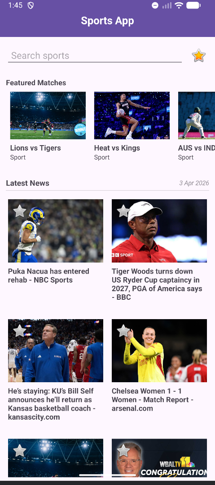
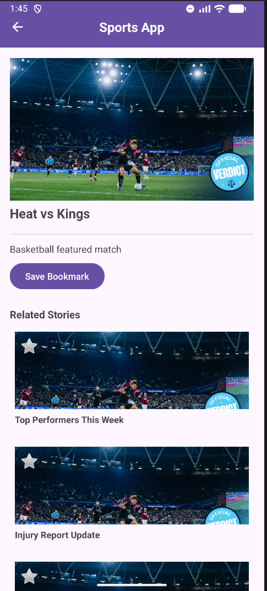
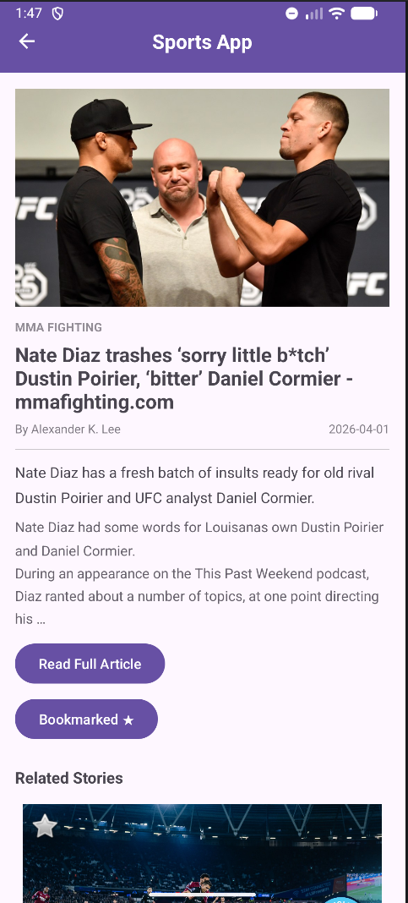
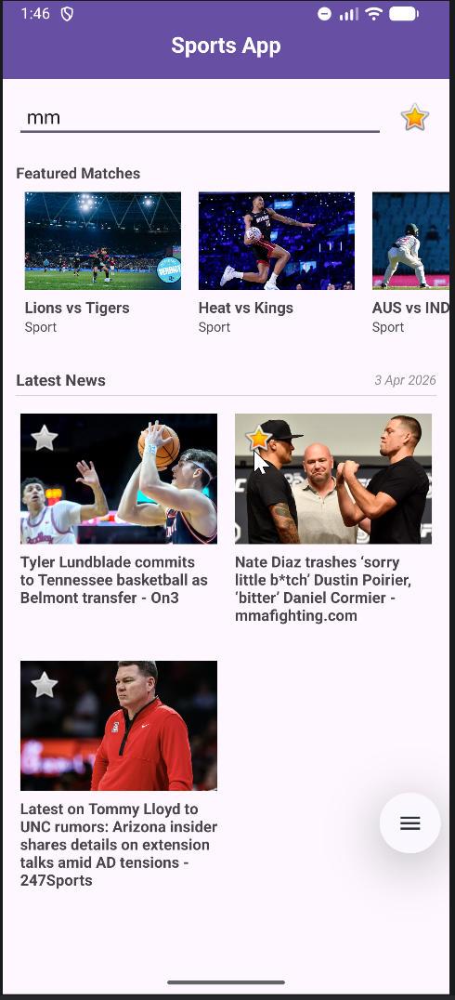
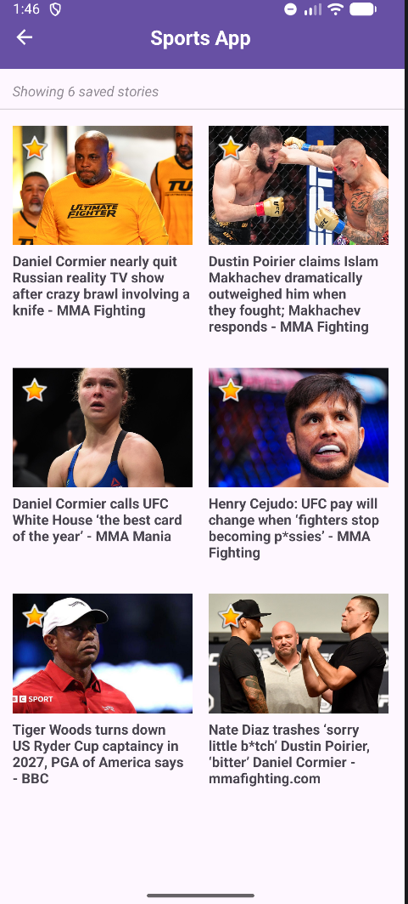
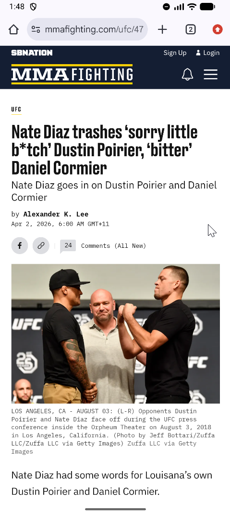

# Sports News Feed App
### SIT305 — Task 5.1C - Subtask 1 - Deakin University

A single-activity Android application that displays live sports news fetched from the NewsAPI, with featured match cards, category filtering, article detail views, and a local bookmark system.

---

## Features

**Home Screen**
- Horizontal RecyclerView showing featured match cards (Football, Basketball, Cricket)
- Vertical grid RecyclerView displaying live sports news articles fetched from NewsAPI (Not required by task but did it anyway!)
- Live search/filter bar — filters articles by title as you type
- Bookmark icon in the toolbar navigates to your saved stories
- Live date label showing today's date for API feed.

**Detail Screen**
- Full article image loaded via Glide
- Source outlet, title, author, published date, description, and body content
- Truncation artefacts from the NewsAPI free tier (`[+N chars]`) are stripped automatically
- "Read Full Article" button opens the original URL in the device browser
- Bookmark toggle button — saves or removes the story locally, label updates instantly
- Related Stories RecyclerView at the bottom (hardcoded dummy data per spec)

**Bookmark Screen**
- Grid view of all saved stories persisted via SharedPreferences + Gson
- Dynamic subheading showing the current saved count
- Tap any card to open its detail view; unbookmark from detail and the count updates on return
- Inline remove via the bookmark star on each card

**Navigation**
- Single Activity architecture — all screens are Fragments
- Toolbar back arrow appears/disappears automatically based on the back stack
- Modern `OnBackPressedDispatcher` used throughout (no deprecated `onBackPressed()` override)

---

## Screenshots

| | | |
|---|---|---|
|  |  |  |
| **Home** | **Featured** | **Detail** |
|  |  |  |
| **Search** | **Bookmark** | **Full Story In Browser** |


## Tech Stack

| Layer | Technology |
|---|---|
| Language | Java |
| Min SDK | 26 (Android 8.0) |
| Target SDK | 36 |
| UI | XML layouts, Material Design 3 |
| Navigation | Fragment Manager (manual back stack) |
| Networking | Retrofit 2 + OkHttp logging interceptor |
| JSON parsing | Gson |
| Image loading | Glide 4.16 |
| Local storage | SharedPreferences + Gson serialisation |
| News source | [NewsAPI.org](https://newsapi.org) |

---

## Project Structure

```
app/src/main/java/com/example/sportsapp/
├── MainActivity.java              # Single activity host, toolbar + fragment nav
├── adapters/
│   ├── MatchAdapter.java          # Horizontal featured match cards
│   └── NewsAdapter.java           # News grid (home + bookmarks + related)
├── api/
│   ├── ApiService.java            # Retrofit interface for NewsAPI
│   ├── NewsResponse.java          # Response model
│   └── RetrofitClient.java        # Retrofit singleton
├── data/
│   └── DummyDataProvider.java     # Fallback static data
├── fragments/
│   ├── HomeFragment.java          # Home screen
│   ├── DetailFragment.java        # Article detail screen
│   └── BookmarkFragment.java      # Saved stories screen
├── models/
│   ├── Match.java                 # Featured match model
│   └── News.java                  # News article model (Serializable)
└── utils/
    └── BookmarkManager.java       # SharedPreferences read/write/remove
```

---

## Setup

### 1. Clone the repository
```bash
Use the button above to get the url!!
```

### 2. Build and run
Open the project in Android Studio, let Gradle sync, then run on a device or emulator (API 26+). No API key configuration required — the NewsAPI key is Base64-encoded and bundled into the build via `BuildConfig`.

---

## Notes

- **Fallback data:** `DummyDataProvider` supplies static match cards and a small set of placeholder news items. These are used for the featured row; the news grid is always API-driven.
- **Free tier truncation:** The NewsAPI free plan truncates article content and appends `[+N chars]`. The app strips this automatically in `DetailFragment`.
- **Bookmarks:** Stored locally using `SharedPreferences` + Gson. No database required — the data is a simple serialised list of `News` objects keyed by title to prevent duplicates.

---

## AI Assistance Declaration

This project was built with assistance from OpenAI - ChatGPT as declared in the submission documentation. ChatGPT acted as the technical implementer under student direction. All architectural changes, scope definitions, and design choices were made by the student. 
AI, it's a love-hate relationship :heart: / :broken_heart:

## Legal

This project was created for educational purposes as part of Deakin University's SIT305 unit. All rights reserved. Reuse, redistribution, or reproduction of any part of this codebase requires explicit written permission from the author.